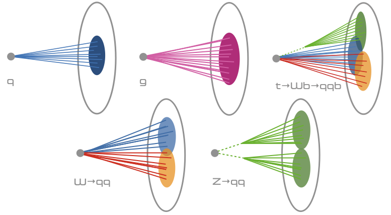

# FPGA Applications on Nautilus: Particle Physics Application

### [Sixth National Research Platform (6NRP) Workshop](https://drive.google.com/file/d/1fEFOtFvdv_qNSk_pYfgiDAqxPppFX0GW/view?usp=sharing)

**[San Diego Supercomputer Center](https://www.sdsc.edu/)**  
**January 28th, 2025**

---
### Instructors: 
**Mohammad Sada** and **Elham E Khoda**    
Email Contact: [mfsada@ucsd.edu](mailto:mfsada@ucsd.edu) and [ekhoda@ucsd.edu](mailto:ekhoda@ucsd.edu)

---

This is the second part of the hands-on tutorial on FPGA Applications on Nautilus. In this par, we will train a simple Deep Neural Network (DNN) with `TensorFlow` + `Keras` and convert the model to into a format such that it can run on an FPGA using a compile tool called [`hls4ml`](https://fastmachinelearning.org/hls4ml/).

The slides are avilable [here]().

---
### Step 1: Sign in to 6NRP JupyterHub

Please go to [https://6nrp.nrp-nautilus.io/](https://6nrp.nrp-nautilus.io/) and log in using CILogon with your University credentials.

JupyterHub will give you access to the cluster without needing to know Kubernetes and how to run your code using Kubernetes Pods / Jobs / Deployments. 

---

### Setp 2: Start your Jupyter Instance
- Select the `6NRP Tutorial: FPGA` environment 
- Select the following configuration:
    - CPU Cores: 4
    - RAM: 32 GB
    - GPU: 0
- Hit start

---

### Step 3: Open Terminal from the JupyterHub Launcher
Open the terminal from the JupyterHub Launcher window.

---

### Step 4: Set up the environment and clone the git repository 

From the terminal we need to do two things:

#### 4.1 Make your environment avilable as a kernels for jupyer notebook

Run this
```
python -m ipykernel install --user --name=hls4ml
```

#### 4.2 Get necessary code from GitHub

Clone the [git repository](https://github.com/nrp-nautilus/6nrp-hls4ml) 
```
git clone https://github.com/nrp-nautilus/6nrp-hls4ml.git
```

---
### Step 5: Deep Neural Network (DNN) Training 

- Open [01_keras_training.ipynb](https://github.com/nrp-nautilus/6nrp-hls4ml/blob/main/01_keras_training.ipynb)   
This is the training notebook. It uses an open [jet-tagging dataset](https://doi.org/10.5281/zenodo.3602260) and trains a DNN (5-class classifier) using `Keras` and `TensorFlow`.

#### Particle Physics: Jet tagging
Jets are spray of particles that serve as experimental signatures of quarks, gluons and other particle. Their appearance varies depending on their origin. In this study, we will examine 5 distinct types of jets.



**Figure:** Cartoon shows 5 different jet classes.

#### Goal: 
Classify the jets into 5 different categories

---

### Step 6: Convert the trained model to HLS using `hls4ml`

- Open [02_hls_conversion.ipynb](https://github.com/nrp-nautilus/6nrp-hls4ml/blob/main/02_hls_conversion.ipynb)   
This notebook shows how to convert a tensorflow model to a HLS model using `hls4ml` and compile (synthesise) with Xilinx tools.


> **Note**  
> We are going to do a hardware emulation using `hls4ml` and Xilinx tools. We are not going to run this application on an actual FPGA. But from the first part you have already seen how to do it. So, you can also run this model on the U55C FPGAs on NRP.